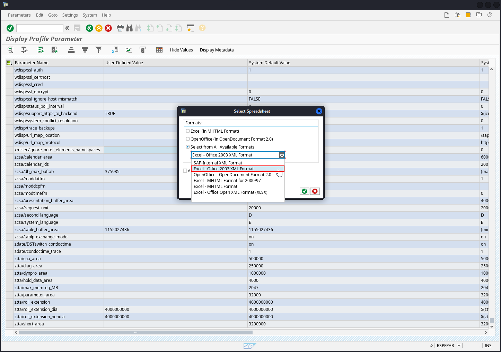

# SAP Parameter Validator (SAPPV)

SAP Parameter Validator is a script-based tool designed for the analysis and validation of SAP configuration parameters. This repository provides a Bash script that utilizes xmllint to extract and evaluate configuration settings from XML files, ensuring compliance with predefined standards and rules.

Key Features:
- Parameter Extraction: Extracts configuration parameters and their values from SAP XML configuration files.
- Validation Rules: Checks values against predefined criteria, such as expected values or ranges, and highlights discrepancies.
- Color-Coded Output: Provides color-coded output to easily identify parameters that meet or fail the validation criteria, with red highlighting for issues and green for compliance.
- Customizable Parameters: Easily configurable with a list of parameters to check, allowing for flexible and comprehensive configuration analysis.


## Using SAPPV

```bash
# Setup
git clone https://github.com/damianStrojek/SAPPV.git
cd SAPPV/
chmod +x SAPPV.sh
# Make sure that your XML file is accessible
mv ~/Download/EXPORT.XML .

# Run
./SAPPV.sh EXPORT.XML
```

The XML file can be obtained from SAP system using Transaction Code `RSPFPAR`. When asked for Profile Parameters, you should provide blank field and click `Execute`, which will show table with all available parameters.

Right click and `Spreadsheet` provides export functionality.


You should choose `Excel Office 2003 XML Format` and export XML file.



## Support Parameters

The table below contains the defined parameters and the conditions for which they are distinguished. Contraint determines whether a given parameter will be colored <b style="color : red">red (potential threat)</b>, <b style="color : green">green (rather good)</b> or <b style="color : yellow">yellow (to be checked)</b>.

For example, if <i>gw/reg_no_conn_info</i> is set to less than 255 (`<255`), then it will be marked in red. Similarly, if <i>icm/security_log</i> is equal to two (`2`), it will also be red.

| Parameter                                      | Constraint  | Description                                    |
|------------------------------------------------|-------------|------------------------------------------------|
| `auth/object_disabling_active`                 | `Y`         | Indicates if object disabling is active.       |
| `auth/rfc_authority_check`                     | `<2`        | Sets the authority check level for RFCs.       |
| `auth/no_check_in_some_cases`                  | `Y`         | Specifies whether checks are bypassed in some cases. |
| `bdc/bdel_auth_check`                         | `FALSE`     | Determines if authorization checks are enforced in BDC. |
| `gw/reg_no_conn_info`                         | `<255`      | Limits the number of characters for registration number connection info. |
| `icm/security_log`                            | `2`         | Defines the security log level for ICM (Internet Communication Manager). |
| `icm/server_port_0`                           | `Display`   | Specifies the server port for ICM (port 0).    |
| `icm/server_port_1`                           | `Display`   | Specifies the server port for ICM (port 1).    |
| `icm/server_port_2`                           | `Display`   | Specifies the server port for ICM (port 2).    |
| `login/password_compliance_to_current_policy`  | `0`         | Enforces password compliance with the current policy. |
| `login/no_automatic_user_sapstar`              | `0`         | Disables automatic user SAPSTAR assignment.   |
| `login/min_password_specials`                  | `0`         | Minimum number of special characters required in passwords. |
| `login/min_password_lng`                       | `<8`        | Minimum length required for passwords.        |
| `login/min_password_lowercase`                 | `0`         | Minimum number of lowercase letters required in passwords. |
| `login/min_password_uppercase`                 | `0`         | Minimum number of uppercase letters required in passwords. |
| `login/min_password_digits`                    | `0`         | Minimum number of digits required in passwords. |
| `login/min_password_letters`                   | `1`         | Minimum number of letters required in passwords. |
| `login/fails_to_user_lock`                     | `<5`        | Number of failed login attempts before locking the user account. |
| `login/password_expiration_time`               | `>90`       | Password expiration time in days.             |
| `login/password_max_idle_initial`              | `<14`       | Maximum idle time in minutes before requiring password re-entry (initial). |
| `login/password_max_idle_productive`           | `<180`      | Maximum idle time in minutes before requiring password re-entry (productive). |
| `login/password_downwards_compatibility`       | `0`         | Specifies if downward compatibility for passwords is enabled. |
| `rfc/reject_expired_passwd`                    | `0`         | Determines if expired passwords are rejected for RFC (Remote Function Calls). |
| `rsau/enable`                                 | `0`         | Enables or disables RS AU (Authorization) checks. |
| `rdisp/gui_auto_logout`                       | `<5`        | Specifies the time in minutes before automatic logout of GUI sessions. |
| `service/protectedwebmethods`                  | `SDEFAULT`  | Specifies the default settings for protected web methods. |
| `snc/enable`                                  | `0`         | Enables or disables Secure Network Communication (SNC). |
| `ucon/rfc/active`                             | `0`         | Activates or deactivates UCON (Unified Connectivity) RFCs. |

## Unauthenticated Scan

When it comes to SAP pentesting, it is also worth it to check out what you can access as an unauthenticated user.

Easiest way is to use tool [powersap]() to which I have additionally prepared iteration script. After some changes to `Invoke-mgmt-con-soap.ps1` it iterates through all checks.

```bash
cd unauthenticated/
chmod +x powersap-clone.sh run-Invoke-mgmt-con-soap.sh

# Prepare powersap
./powersap-clone.sh

# Remember to make necessary changes to powersap/Standalone/soap/`Invoke-mgmt-con-soap.ps1
./run-Invoke-mgmt-con-soap.sh
```

## Disclaimer

SAP Parameter Validator is intended solely for the purpose of testing and validating SAP configuration settings. This tool is designed to assist administrators and auditors in ensuring that SAP configurations adhere to predefined standards and guidelines.

The creators and maintainers of this tool are not responsible for any misuse or legal implications arising from its use. Always ensure that you have the proper authorization before performing any configuration analysis.
